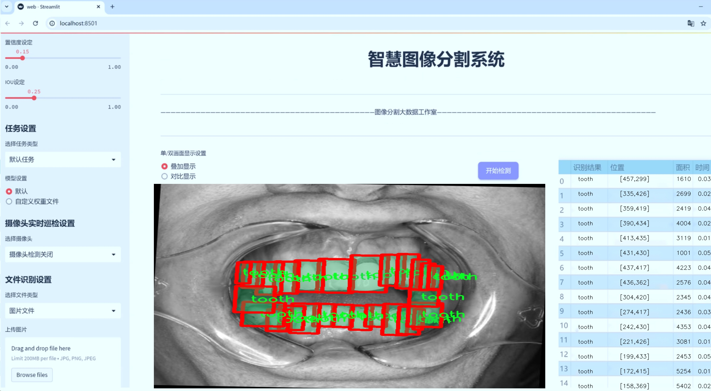
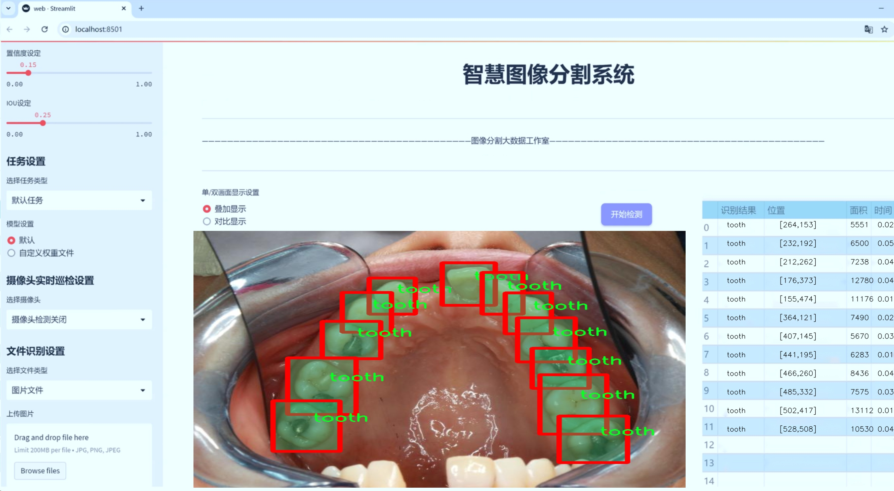
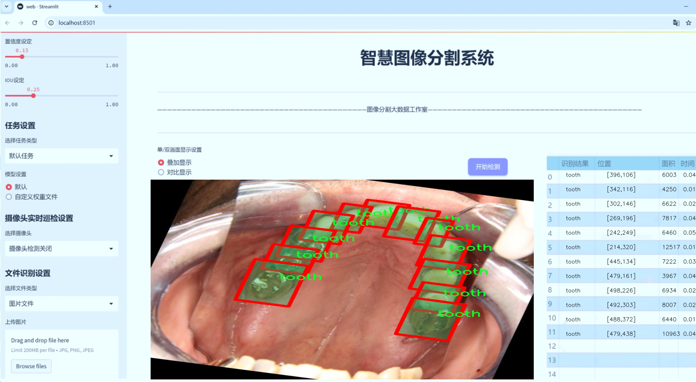
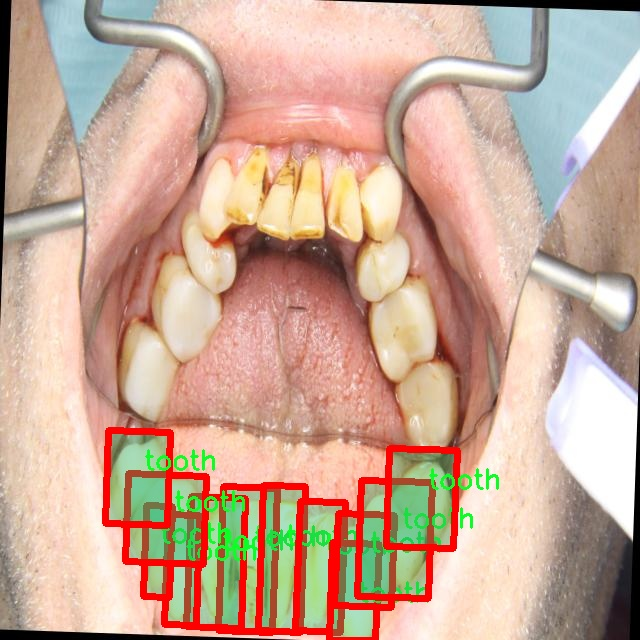
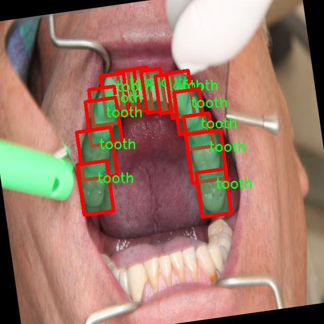
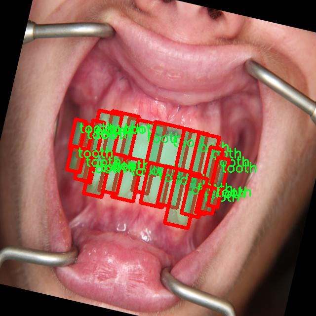
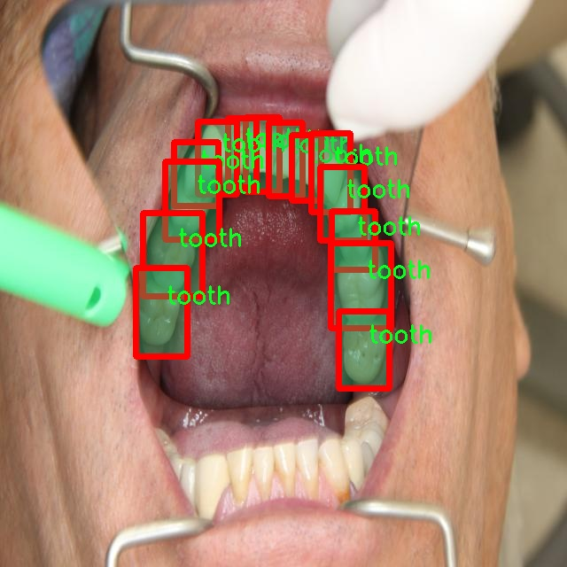
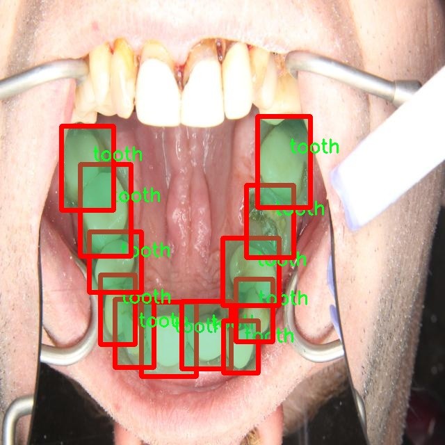

# 口腔内牙齿分割系统源码＆数据集分享
 [yolov8-seg-slimneck＆yolov8-seg-GFPN等50+全套改进创新点发刊_一键训练教程_Web前端展示]

### 1.研究背景与意义

项目参考[ILSVRC ImageNet Large Scale Visual Recognition Challenge](https://gitee.com/YOLOv8_YOLOv11_Segmentation_Studio/projects)

项目来源[AAAI Global Al lnnovation Contest](https://kdocs.cn/l/cszuIiCKVNis)

研究背景与意义

随着数字化技术的迅猛发展，口腔医学领域也逐渐向智能化、自动化方向迈进。传统的口腔诊断方法依赖于医生的经验和直觉，存在一定的主观性和局限性。近年来，计算机视觉技术的进步为口腔内图像的分析提供了新的解决方案，尤其是在牙齿分割和检测方面。牙齿的准确识别与分割不仅对口腔疾病的早期诊断至关重要，还能为后续的治疗方案提供科学依据。因此，构建一个高效、准确的口腔内牙齿分割系统具有重要的临床意义和应用价值。

在众多计算机视觉算法中，YOLO（You Only Look Once）系列模型因其实时性和高效性而备受关注。YOLOv8作为该系列的最新版本，结合了深度学习和图像处理的优势，能够在复杂的环境中实现高精度的目标检测与分割。通过对YOLOv8进行改进，特别是在处理口腔内图像时，可以显著提高牙齿的分割精度和效率。这对于临床医生在进行口腔检查时，能够快速、准确地识别出患者的牙齿状况，进而制定个性化的治疗方案，具有重要的现实意义。

本研究所使用的数据集包含1200张口腔内图像，涵盖了34个类别，涉及11至48等多个牙齿类别。这一丰富的数据集为模型的训练和验证提供了坚实的基础。通过对不同类别牙齿的实例分割，不仅可以提升模型的泛化能力，还能为后续的研究提供更多的样本支持。此外，数据集中多样化的牙齿类型和形态特征，能够帮助模型更好地适应临床实际情况，提升其在不同患者口腔内图像中的应用效果。

在技术层面，本研究将结合图像预处理、特征提取和后处理等多种技术手段，针对YOLOv8模型进行一系列改进，以适应口腔内牙齿的复杂结构和多样化形态。通过引入数据增强、迁移学习等方法，可以有效提升模型的鲁棒性和准确性，从而实现对牙齿的精准分割。这一研究不仅为口腔医学的智能化发展提供了技术支持，也为后续的相关研究奠定了基础。

综上所述，基于改进YOLOv8的口腔内牙齿分割系统的研究，既是对当前口腔医学诊断技术的有力补充，也是推动智能医疗发展的重要一步。通过提高牙齿分割的准确性和效率，可以为口腔疾病的早期诊断和治疗提供更为可靠的依据，最终提升患者的就医体验和治疗效果。

### 2.图片演示







##### 注意：由于此博客编辑较早，上面“2.图片演示”和“3.视频演示”展示的系统图片或者视频可能为老版本，新版本在老版本的基础上升级如下：（实际效果以升级的新版本为准）

  （1）适配了YOLOV8的“目标检测”模型和“实例分割”模型，通过加载相应的权重（.pt）文件即可自适应加载模型。

  （2）支持“图片识别”、“视频识别”、“摄像头实时识别”三种识别模式。

  （3）支持“图片识别”、“视频识别”、“摄像头实时识别”三种识别结果保存导出，解决手动导出（容易卡顿出现爆内存）存在的问题，识别完自动保存结果并导出到tempDir中。

  （4）支持Web前端系统中的标题、背景图等自定义修改，后面提供修改教程。

  另外本项目提供训练的数据集和训练教程,暂不提供权重文件（best.pt）,需要您按照教程进行训练后实现图片演示和Web前端界面演示的效果。

### 3.视频演示

[3.1 视频演示](https://www.bilibili.com/video/BV1MY2zYmEH7/)

### 4.数据集信息展示

##### 4.1 本项目数据集详细数据（类别数＆类别名）

nc: 1
names: ['tooth']


##### 4.2 本项目数据集信息介绍

数据集信息展示

在本研究中，我们采用了名为“Intraoral Tooth Detection”的数据集，以支持改进YOLOv8-seg模型在口腔内牙齿分割任务中的性能。该数据集专门针对口腔内牙齿的检测与分割而设计，旨在为口腔医学、牙科影像分析以及相关领域提供高质量的训练数据。数据集的独特之处在于其专注于单一类别的牙齿，这使得模型在特定任务上的表现更加精准和高效。

“Intraoral Tooth Detection”数据集包含丰富的口腔内牙齿图像，涵盖了不同的拍摄角度、光照条件以及牙齿的多样性。这些图像不仅展示了健康牙齿的形态，还包括了不同病理状态下的牙齿，例如龋齿、缺损等。这种多样性为模型的训练提供了广泛的场景，使其能够更好地适应实际应用中的各种情况。通过这种方式，研究者可以确保模型在面对不同类型的牙齿时，依然能够保持高水平的分割精度。

数据集的类别数量为1，唯一的类别名称为“tooth”。这一设计简化了模型的训练过程，使得模型能够专注于牙齿的特征提取与分割。尽管类别数量较少，但在图像处理和深度学习的背景下，单一类别的深度学习模型往往能够通过更为细致的特征学习来实现卓越的性能。通过针对“tooth”这一类别的专门训练，YOLOv8-seg模型能够有效捕捉牙齿的形状、边缘及其在口腔内的相对位置，从而实现精准的分割。

在数据集的构建过程中，研究者们采取了严格的标准，以确保图像的质量和标注的准确性。每一张图像都经过专业牙科医生的审核，确保其在医学上的有效性和可靠性。此外，数据集还考虑到了不同患者的个体差异，包含了不同年龄、性别及种族的样本，这对于提高模型的泛化能力至关重要。通过这种多样化的样本选择，研究者能够更好地应对临床环境中可能遇到的各种挑战。

在训练过程中，数据集将被分为训练集和验证集，以便于对模型的性能进行评估和调整。训练集将用于模型的学习，而验证集则用于监测模型在未见数据上的表现。这种划分策略能够有效防止模型的过拟合现象，从而提升其在实际应用中的可靠性。

总之，“Intraoral Tooth Detection”数据集为改进YOLOv8-seg的口腔内牙齿分割系统提供了坚实的基础。通过专注于牙齿这一单一类别，该数据集不仅提升了模型的训练效率，也为后续的临床应用提供了重要的数据支持。随着研究的深入，期待这一系统能够在口腔医学领域发挥更大的作用，为牙科诊断和治疗提供更为精准的技术支持。











### 5.全套项目环境部署视频教程（零基础手把手教学）

[5.1 环境部署教程链接（零基础手把手教学）](https://www.bilibili.com/video/BV1jG4Ve4E9t/?vd_source=bc9aec86d164b67a7004b996143742dc)


[5.2 安装Python虚拟环境创建和依赖库安装视频教程链接（零基础手把手教学）](https://www.bilibili.com/video/BV1nA4VeYEze/?vd_source=bc9aec86d164b67a7004b996143742dc)

### 6.手把手YOLOV8-seg训练视频教程（零基础小白有手就能学会）

[6.1 手把手YOLOV8-seg训练视频教程（零基础小白有手就能学会）](https://www.bilibili.com/video/BV1cA4VeYETe/?vd_source=bc9aec86d164b67a7004b996143742dc)


按照上面的训练视频教程链接加载项目提供的数据集，运行train.py即可开始训练



     Epoch   gpu_mem       box       obj       cls    labels  img_size
     1/200     0G   0.01576   0.01955  0.007536        22      1280: 100%|██████████| 849/849 [14:42<00:00,  1.04s/it]
               Class     Images     Labels          P          R     mAP@.5 mAP@.5:.95: 100%|██████████| 213/213 [01:14<00:00,  2.87it/s]
                 all       3395      17314      0.994      0.957      0.0957      0.0843

     Epoch   gpu_mem       box       obj       cls    labels  img_size
     2/200     0G   0.01578   0.01923  0.007006        22      1280: 100%|██████████| 849/849 [14:44<00:00,  1.04s/it]
               Class     Images     Labels          P          R     mAP@.5 mAP@.5:.95: 100%|██████████| 213/213 [01:12<00:00,  2.95it/s]
                 all       3395      17314      0.996      0.956      0.0957      0.0845

     Epoch   gpu_mem       box       obj       cls    labels  img_size
     3/200     0G   0.01561    0.0191  0.006895        27      1280: 100%|██████████| 849/849 [10:56<00:00,  1.29it/s]
               Class     Images     Labels          P          R     mAP@.5 mAP@.5:.95: 100%|███████   | 187/213 [00:52<00:00,  4.04it/s]
                 all       3395      17314      0.996      0.957      0.0957      0.0845


### 7.50+种全套YOLOV8-seg创新点代码加载调参视频教程（一键加载写好的改进模型的配置文件）

[7.1 50+种全套YOLOV8-seg创新点代码加载调参视频教程（一键加载写好的改进模型的配置文件）](https://www.bilibili.com/video/BV1Hw4VePEXv/?vd_source=bc9aec86d164b67a7004b996143742dc)

### 8.YOLOV8-seg图像分割算法原理

原始YOLOv8-seg算法原理

YOLOv8-seg算法是YOLO系列中最新的版本，专注于目标检测与分割任务。其设计理念在于结合实时性与高精度，旨在为计算机视觉领域提供一种高效且准确的解决方案。该算法在YOLOv5的基础上进行了多项改进，吸收了近两年内在目标检测领域的各种创新，尤其是在分割任务的实现上，展现出强大的能力。

首先，YOLOv8-seg算法的输入端采用了先进的数据增强技术，其中包括马赛克（Mosaic）数据增强。虽然马赛克增强能够有效提升模型的鲁棒性和泛化能力，但在训练的最后阶段，YOLOv8-seg算法会停止使用这种增强方式，以避免对数据真实分布的干扰。通过这种策略，模型能够更好地学习到真实场景中的特征，提升分割精度。

在网络结构方面，YOLOv8-seg算法的主干网络进行了显著优化。与之前的YOLO版本相比，YOLOv8-seg将C3模块替换为C2f模块，这一变化不仅保持了模型的轻量化特性，还引入了更多的跳层连接，增强了梯度流的信息传递。这种设计使得模型在特征提取时能够获得更丰富的上下文信息，从而提升了对复杂场景的理解能力。此外，YOLOv8-seg依然保留了空间金字塔池化（SPPF）模块，这一模块在保持效果的同时显著减少了执行时间，进一步提升了模型的运行效率。

在颈部网络的设计上，YOLOv8-seg同样进行了重要的改进。所有的C3模块被替换为C2f模块，且在上采样之前的卷积连接层数量被削减。这种简化不仅提升了特征融合的效率，还加强了模型对不同尺度目标的适应能力，确保了在各种环境下的检测性能。

YOLOv8-seg算法的头部网络采用了解耦头的设计思路，分别为分类和定位任务设置了独立的分支。这种结构的引入，使得模型在处理分类和定位时能够更好地聚焦于各自的任务特性。分类任务更关注特征图中类别的相似性，而定位任务则专注于边界框与真实框之间的关系。通过这种解耦设计，YOLOv8-seg在收敛速度和预测精度上均有所提升。

值得一提的是，YOLOv8-seg采用了无锚框（Anchor-Free）结构，直接预测目标的中心位置。这一创新显著减少了锚框的数量，从而加速了非最大抑制（NMS）过程，提升了模型的推理速度。此外，算法引入了任务对齐学习（Task Alignment Learning, TAL）机制，以优化正负样本的区分能力。通过将分类分数与IOU的高次幂乘积结合，YOLOv8-seg能够更有效地衡量任务对齐程度，从而在分类和定位损失函数中引入这一指标，确保模型在这两个方面均能取得良好的表现。

在性能评估方面，YOLOv8-seg在COCO数据集上的表现相较于前代模型有了显著提升。其mAP（mean Average Precision）指标在不同的IOU阈值下均表现出色，显示出该算法在复杂场景下的优越性。此外，YOLOv8-seg在推理速度上也具备了很强的竞争力，能够满足实时应用的需求。这一系列的改进，使得YOLOv8-seg在目标检测与分割任务中展现出更高的准确性和效率，成为计算机视觉领域的重要工具。

综上所述，YOLOv8-seg算法通过一系列结构上的创新与优化，成功地将目标检测与分割任务的性能提升至新的高度。其在输入端的数据增强策略、主干网络的模块设计、颈部网络的特征融合能力以及头部网络的解耦设计等方面的改进，使得YOLOv8-seg不仅具备了良好的实时性，还在精度上达到了行业领先水平。这些特性使得YOLOv8-seg在各种应用场景中都具备了广泛的适用性，尤其是在需要快速响应和高精度的任务中，展现出其独特的价值。随着对YOLOv8-seg算法的深入研究与应用，未来其在计算机视觉领域的潜力将进一步被挖掘，为更多的实际应用提供支持。


### 9.系统功能展示（检测对象为举例，实际内容以本项目数据集为准）

图9.1.系统支持检测结果表格显示

  图9.2.系统支持置信度和IOU阈值手动调节

  图9.3.系统支持自定义加载权重文件best.pt(需要你通过步骤5中训练获得)

  图9.4.系统支持摄像头实时识别

  图9.5.系统支持图片识别

  图9.6.系统支持视频识别

  图9.7.系统支持识别结果文件自动保存

  图9.8.系统支持Excel导出检测结果数据


### 10.50+种全套YOLOV8-seg创新点原理讲解（非科班也可以轻松写刊发刊，V11版本正在科研待更新）

#### 10.1 由于篇幅限制，每个创新点的具体原理讲解就不一一展开，具体见下列网址中的创新点对应子项目的技术原理博客网址【Blog】：


[10.1 50+种全套YOLOV8-seg创新点原理讲解链接](https://gitee.com/qunmasj/good)

#### 10.2 部分改进模块原理讲解(完整的改进原理见上图和技术博客链接)【如果此小节的图加载失败可以通过CSDN或者Github搜索该博客的标题访问原始博客，原始博客图片显示正常】
### YOLOv8简介
在各种目标检测算法中，YOLO系列因其速度和准确度间的优异平衡脱颖而出，能够准确、快速的识别目标，便于部署到各种移动设备中，已经广泛应用于各种领域的目标检测、跟踪和分割。目前最新版本 YOLOv8由原v5的开发团队Ultralytics于2023年1月提出，按规格大小可划分为n、s、m、1和x5个版本，是目前最先进的目标检测算法，有着优异的性能，很适合用于无人机航拍图像目标检测。其网络结构如图所示。

YOLOv8模型包括Input、Backbone、Neck 和Head4部分。其中 Input选用了Mosaic数据增强方法，并且对于不同大小的模型，有部分超参数会进行修改，典型的如大模型会开启 MixUp 和CopyPaste数据增强，能够丰富数据集，提升模型的泛化能力和鲁棒性。Backbone主要用于提取图片中的信息，提供给Neck和Head使用，由多个Conv、C2f模块和尾部的SPPF组成。Conv模块由单个Conv2d、
BatchNorm2d和激活函数构成,用丁是双行在万E5特征图;YOLOv8参考了C3模块的残左绒以心YOLOv7[16l的ELAN思想，设计出了C2f 结构，可以在保证轻量化的同时获得更加丰富的梯度流信息，并根据模型尺度来调整通道数，大幅提升了模型性能;SPPF是空间金字塔池化，能够融合不同尺度的特征。Neck部分主要起特征融合的作用，充分利用了骨干网络提取的特征，采用FPN[17]+PAN[18〕结构，
能够增强多个尺度上的语义表达和定位能力。Head输出端根据前两部分处理得到的特征来获取检测目标的类别和位置信息，做出识别,换以小旦公来和定解耦头结构,将分类和检测头分:9w‘无锅框的位关注侧重点不同的问题，同时也采用了无锚框的目标检测（Anchor-Free)，能够提升检测速度。Loss计算方面采用了正负样本动态分配策略，使用 VFLLoss 作为分类损失，使用DFLLoss+CIOU Loss作为回归损失。

### AutoFocus: Efficient Multi-Scale Conv简介

参考该博客提出了AutoFocus，一种高效的多尺度目标检测算法。相较于以前对整个图像金字塔进行处理，该方法以一种由表及里的姿态，仅处理哪些整体上看来很有可能存在小物体的区域。这个可以通过预测一张类别未知的分割图FocusPixels来得到。为了高效利用FocusPixels，另外一个算法用于产生包含FocusPixels的FocusChips，这样可以减少计算量并处理更更精细的尺度。在不同尺度上FocusChips所得到的检测结果综合时，会出现问题，我们也提供了解决问题的方案。AutoFocus在COCO上的结果有49.7%mAP（50%重叠下68.3%），与多尺度baseline相仿但是快了2.5倍。金字塔中处理的像素数量减少了5倍mAP只下降1%，在与RetinaNet采用相同的ResNet-101结构且速度相同时，高了10%mAP。

人类寻找物体是一个动态的过程，且寻找时间与场景的复杂度是直接相关的。当我们的眼神在不同的点之间漂移时，其他的区域会被我们有意忽视。然而，现在的检测算法是一种静态的推理过程且图像金字塔中的每个像素都受到了一样的对待，这使得过程变得没有效率。现在许多的应用都不强调实时性，而计算上的节省其实可以产生很大收益。

在COCO数据集中，虽然40%的物体都是小物体，但是它们一共只占了全图的0.3%。如果金字塔是3倍关系，则在高分辨率层要进行9倍的运算。XXX 。那么有没有办法在低分辨率下找出可能含有这些物体的区域呢？

以人眼方案类比，我们可以从低分辨率图像开始，找出有可能存在物体的区域再“聚集”到高分辨率。我们的AutoFocus会在一层中计算小物体的分割图FocusPixels，而在每一个FocusPixels上会用一个算法产生下一层所需要关注的chips。在COCO的最大分辨率层上我们可以只处理**20%的像素而性能不下降，如果只处理5%**也只下降1%而已。


图像金字塔与卷积神经网络对CV十分重要。然而卷积神经网络无法做到对尺度不敏感，所以为了不同大小的物体需要依赖图像金字塔。虽然训练已经有了高效的方法，但是其推断时间依然远离实际使用标准。

目标检测加速有很长历史了。常用的有特征近似以减少尺度、级联、特征金字塔，且最后一个最近很多人研究。

AutoFocus为速度与精度之间提供了一个平滑的折衷，指出可以在低分辨率下看出小物体的所在，从而节约计算。FocusPixels的计算较为容易。

先简单介绍一下SNIP，是一种多尺度的训练、推断算法。主要思想是训练针对某个特定scale的检测器而不是scale-invariant检测器。这样训练样本就局限于在某个尺度范围内，以适于这个检测器处理。比如在高分辨率仅处理小物体而高分辨率仅处理大物体，其优势在于训练时不用考虑尺度的变化。

由于训练时物体大小是已知的，我们在图像金字塔中可以忽略大量区域而只处理物体周围的区域。SNIPER说明这样低分辨率的训练与全图训练相比并不会降低性能。同样，在推断过程中如果可以在大分辨率图像上预测可能出现小物体的chip，我们也就不用处理整张高分辨率图片。在训练时，许多物体会被裁剪、扭曲，这可以当作是一种数据扩增，然而当这个情况在推断时出现，则会产生错误，所以我们还需要一个算法来整合不同尺度上的检测结果。

#### AutoFocus框架
如SIFT、SURF等传统分类特征包含两个组件，一个detector和一个descriptor。detector只包含轻量级的操作如DoG、LoG，用于在整张图片上找到感兴趣的区域；descriptor，一般来说计算量比较大，则只需要关注那些咸兴趣的区域。这个级联结构保障了图片处理的效率。

同样，AutoFocus框架也是用于预测感兴趣的区域，并丢弃在下一尺度不可能存在物体的区域，并将裁剪和缩放后的区域传递给下一尺度。AutoFocus由三个部分组成：FocusPixels，FocusChips和focus stacking。

#### FocusPixels
FocusPixels定义在卷积网络特征图的粒度之上（如conv5），如果特征图上某个像素与小物体有重叠则标注为一个FocusPixel。（小物体：面积处于一个网络的输入范围之内）。训练过程中，FocusPixels标注为正，某些与不在面积范围内的物体有重叠的像素标注为无效，其他像素标注为负。AutoFocus的训练目标是使在FocusPixels区域产生较大的激活值。

如果同时多个物体与同一像素重叠，优先给正标注。我们的网络输入是512x512，然后a,b,c取值分别是5,64,90。对于太大或太小的物体，我们认为当前尺度上没有足够人信息进行判断，所以会标定为无效。整个网络结构如下图。训练时加两层带ReLU的卷积(3x3和1x1)以及一个二分类softmax来预测FocusPixels。


#### FocusChip生成
推断过程中，我们标注输出概率大于阈值t的像素（这个参数可以控制加速比），得到一些连通域。对于每一个域，我们做一次膨胀使其包含一些有助于识别的周围信息，膨胀后相连的部分要合并。然后，我们生成一些包含连通域的chips（不同chips可能重叠，如有重叠则合并）。有些chip可能太小缺少必要信息，并使chip的大小变化很大，为了效率我们要求保证一个最小的chip size。算法流程如下：


#### 级联推断过程
我们的过程类似于图片金字塔的推断过程但是在过程中一步步去除不关注的图片区域。我们在最低分辨率上进行检测并生成chips，然后在这些chips再进行检测和生成chips。

#### Focus Stacking
这种级联分类器的一个问题是在chip边缘本来的大物体可能生成一些被剪裁的检测目标。在下一个尺度上，由于剪裁过了，所以会检测到小的、错误的正例False Positive。之前算法中的第二步膨胀其实就是为了保证没有物体会出现在chip的边缘。这样，当我们在局部图片chip的边缘检测到物体时，就可以把这个检测结果丢弃，即使其在SNIP的范围内。

也有一些物体在图片边缘的特殊情况。如果chip和图片共享一条边的话，我们会检查检测结果的其他边是否完全在里面，如果在，则保留它，否则丢弃。

在每一尺度得到有效检测结果后，我们可以将不同尺度上的结果进行整合，将这些结果映射到原图坐标系上。最后，非极大值抑制NMS用于聚集。网络结构如之前的图片所示。


### 11.项目核心源码讲解（再也不用担心看不懂代码逻辑）

#### 11.1 ui.py

以下是经过精简和注释的核心代码部分：

```python
import sys
import subprocess
from QtFusion.path import abs_path

def run_script(script_path):
    """
    使用当前 Python 环境运行指定的脚本。

    Args:
        script_path (str): 要运行的脚本路径
    """
    # 获取当前 Python 解释器的路径
    python_path = sys.executable

    # 构建运行命令，使用 streamlit 运行指定的脚本
    command = f'"{python_path}" -m streamlit run "{script_path}"'

    # 执行命令并捕获结果
    result = subprocess.run(command, shell=True)
    
    # 检查命令执行是否成功
    if result.returncode != 0:
        print("脚本运行出错。")

# 主程序入口
if __name__ == "__main__":
    # 获取要运行的脚本的绝对路径
    script_path = abs_path("web.py")

    # 调用函数运行脚本
    run_script(script_path)
```

### 代码分析与注释：

1. **导入模块**：
   - `sys`：用于访问与 Python 解释器相关的变量和函数。
   - `subprocess`：用于执行外部命令。
   - `abs_path`：从 `QtFusion.path` 模块导入的函数，用于获取文件的绝对路径。

2. **`run_script` 函数**：
   - 功能：接受一个脚本路径作为参数，并在当前 Python 环境中运行该脚本。
   - 参数：
     - `script_path`：要运行的脚本的路径。
   - 实现步骤：
     - 获取当前 Python 解释器的路径，存储在 `python_path` 变量中。
     - 构建命令字符串，使用 `streamlit` 模块运行指定的脚本。
     - 使用 `subprocess.run` 执行命令，并将结果存储在 `result` 变量中。
     - 检查命令的返回码，如果不为 0，表示执行出错，打印错误信息。

3. **主程序入口**：
   - 使用 `if __name__ == "__main__":` 确保只有在直接运行该脚本时才会执行以下代码。
   - 获取 `web.py` 脚本的绝对路径，并调用 `run_script` 函数执行该脚本。

这个程序文件 `ui.py` 的主要功能是通过当前的 Python 环境来运行一个指定的脚本，具体是一个名为 `web.py` 的文件。首先，程序导入了必要的模块，包括 `sys`、`os` 和 `subprocess`，其中 `sys` 用于访问与 Python 解释器相关的变量和函数，`os` 用于与操作系统交互，而 `subprocess` 则用于执行外部命令。

在 `run_script` 函数中，首先定义了一个参数 `script_path`，它是要运行的脚本的路径。函数内部首先获取当前 Python 解释器的路径，接着构建一个命令字符串，这个命令字符串用于调用 `streamlit` 模块来运行指定的脚本。`streamlit` 是一个用于构建数据应用的库。

使用 `subprocess.run` 方法执行构建好的命令，并通过 `shell=True` 参数在 shell 中运行该命令。执行后，程序会检查返回的状态码，如果返回码不为零，表示脚本运行出错，则会打印出相应的错误信息。

在文件的最后部分，使用 `if __name__ == "__main__":` 语句来确保当该文件作为主程序运行时，才会执行下面的代码。这里指定了要运行的脚本路径 `web.py`，并调用 `run_script` 函数来执行该脚本。

总的来说，这个文件的功能是封装了一个简单的接口，用于在当前 Python 环境中运行一个 Streamlit 应用脚本，便于用户通过命令行来启动 Web 应用。

#### 11.2 ultralytics\trackers\byte_tracker.py

以下是代码中最核心的部分，并附上详细的中文注释：

```python
import numpy as np
from .basetrack import BaseTrack, TrackState
from .utils import matching
from .utils.kalman_filter import KalmanFilterXYAH

class STrack(BaseTrack):
    """
    单目标跟踪表示，使用卡尔曼滤波进行状态估计。

    该类负责存储有关单个跟踪的所有信息，并根据卡尔曼滤波器执行状态更新和预测。
    """

    shared_kalman = KalmanFilterXYAH()  # 共享的卡尔曼滤波器实例

    def __init__(self, tlwh, score, cls):
        """初始化新的STrack实例。"""
        # 将输入的边界框格式转换为tlwh格式并存储
        self._tlwh = np.asarray(self.tlbr_to_tlwh(tlwh[:-1]), dtype=np.float32)
        self.kalman_filter = None  # 初始化卡尔曼滤波器
        self.mean, self.covariance = None, None  # 初始化均值和协方差
        self.is_activated = False  # 跟踪是否被激活的标志

        self.score = score  # 跟踪的置信度分数
        self.tracklet_len = 0  # 跟踪片段的长度
        self.cls = cls  # 目标的类别标签
        self.idx = tlwh[-1]  # 目标的索引

    def predict(self):
        """使用卡尔曼滤波器预测目标的下一个状态。"""
        mean_state = self.mean.copy()  # 复制当前均值状态
        if self.state != TrackState.Tracked:  # 如果状态不是被跟踪
            mean_state[7] = 0  # 将速度设置为0
        # 使用卡尔曼滤波器进行预测
        self.mean, self.covariance = self.kalman_filter.predict(mean_state, self.covariance)

    def activate(self, kalman_filter, frame_id):
        """启动一个新的跟踪片段。"""
        self.kalman_filter = kalman_filter  # 设置卡尔曼滤波器
        self.track_id = self.next_id()  # 获取下一个跟踪ID
        # 初始化卡尔曼滤波器的状态
        self.mean, self.covariance = self.kalman_filter.initiate(self.convert_coords(self._tlwh))

        self.tracklet_len = 0  # 重置跟踪片段长度
        self.state = TrackState.Tracked  # 设置状态为跟踪
        if frame_id == 1:
            self.is_activated = True  # 如果是第一帧，激活跟踪
        self.frame_id = frame_id  # 当前帧ID
        self.start_frame = frame_id  # 目标首次检测的帧

    def update(self, new_track, frame_id):
        """
        更新匹配跟踪的状态。

        参数:
            new_track (STrack): 包含更新信息的新跟踪。
            frame_id (int): 当前帧的ID。
        """
        self.frame_id = frame_id  # 更新当前帧ID
        self.tracklet_len += 1  # 增加跟踪片段长度

        new_tlwh = new_track.tlwh  # 获取新的边界框
        # 使用卡尔曼滤波器更新状态
        self.mean, self.covariance = self.kalman_filter.update(self.mean, self.covariance,
                                                               self.convert_coords(new_tlwh))
        self.state = TrackState.Tracked  # 设置状态为跟踪
        self.is_activated = True  # 激活跟踪

        self.score = new_track.score  # 更新置信度分数
        self.cls = new_track.cls  # 更新类别标签
        self.idx = new_track.idx  # 更新索引

    @staticmethod
    def tlwh_to_xyah(tlwh):
        """将边界框转换为格式 (中心x, 中心y, 宽高比, 高度)。"""
        ret = np.asarray(tlwh).copy()  # 复制输入的边界框
        ret[:2] += ret[2:] / 2  # 计算中心坐标
        ret[2] /= ret[3]  # 计算宽高比
        return ret  # 返回转换后的边界框

class BYTETracker:
    """
    BYTETracker: 基于YOLOv8的目标检测和跟踪算法。

    该类负责初始化、更新和管理视频序列中检测到的目标的跟踪。它维护跟踪、丢失和移除的状态，
    利用卡尔曼滤波预测新目标位置，并执行数据关联。
    """

    def __init__(self, args, frame_rate=30):
        """使用给定参数和帧率初始化YOLOv8对象以跟踪目标。"""
        self.tracked_stracks = []  # 成功激活的跟踪列表
        self.lost_stracks = []  # 丢失的跟踪列表
        self.removed_stracks = []  # 移除的跟踪列表

        self.frame_id = 0  # 当前帧ID
        self.args = args  # 命令行参数
        self.max_time_lost = int(frame_rate / 30.0 * args.track_buffer)  # 最大丢失时间
        self.kalman_filter = self.get_kalmanfilter()  # 获取卡尔曼滤波器
        self.reset_id()  # 重置ID

    def update(self, results, img=None):
        """使用新检测更新对象跟踪并返回跟踪对象的边界框。"""
        self.frame_id += 1  # 增加帧ID
        activated_stracks = []  # 激活的跟踪列表
        refind_stracks = []  # 重新找到的跟踪列表
        lost_stracks = []  # 丢失的跟踪列表
        removed_stracks = []  # 移除的跟踪列表

        scores = results.conf  # 检测分数
        bboxes = results.xyxy  # 检测边界框
        # 添加索引
        bboxes = np.concatenate([bboxes, np.arange(len(bboxes)).reshape(-1, 1)], axis=-1)
        cls = results.cls  # 检测类别

        # 根据置信度分数筛选检测
        remain_inds = scores > self.args.track_high_thresh
        inds_low = scores > self.args.track_low_thresh
        inds_high = scores < self.args.track_high_thresh

        # 获取高分和低分的检测
        dets = bboxes[remain_inds]
        scores_keep = scores[remain_inds]
        cls_keep = cls[remain_inds]

        # 初始化跟踪
        detections = self.init_track(dets, scores_keep, cls_keep, img)
        # 将新检测的跟踪片段添加到tracked_stracks
        unconfirmed = []  # 未确认的跟踪
        tracked_stracks = []  # 已确认的跟踪
        for track in self.tracked_stracks:
            if not track.is_activated:
                unconfirmed.append(track)  # 未激活的跟踪
            else:
                tracked_stracks.append(track)  # 已激活的跟踪

        # 进行数据关联和状态更新
        strack_pool = self.joint_stracks(tracked_stracks, self.lost_stracks)  # 合并跟踪列表
        self.multi_predict(strack_pool)  # 预测当前位置信息

        # 进行数据关联
        dists = self.get_dists(strack_pool, detections)  # 计算距离
        matches, u_track, u_detection = matching.linear_assignment(dists, thresh=self.args.match_thresh)  # 匹配

        # 更新匹配的跟踪
        for itracked, idet in matches:
            track = strack_pool[itracked]
            det = detections[idet]
            track.update(det, self.frame_id)  # 更新跟踪状态
            activated_stracks.append(track)  # 添加到激活列表

        # 处理未确认的跟踪
        for it in u_track:
            track = strack_pool[it]
            if track.state != TrackState.Lost:
                track.mark_lost()  # 标记为丢失
                lost_stracks.append(track)  # 添加到丢失列表

        # 初始化新的跟踪
        for inew in u_detection:
            track = detections[inew]
            if track.score < self.args.new_track_thresh:
                continue
            track.activate(self.kalman_filter, self.frame_id)  # 激活新的跟踪
            activated_stracks.append(track)  # 添加到激活列表

        # 更新状态
        self.tracked_stracks = [t for t in self.tracked_stracks if t.state == TrackState.Tracked]  # 过滤有效跟踪
        self.tracked_stracks = self.joint_stracks(self.tracked_stracks, activated_stracks)  # 合并激活的跟踪
        self.lost_stracks.extend(lost_stracks)  # 添加丢失的跟踪
        self.removed_stracks.extend(removed_stracks)  # 添加移除的跟踪

        return np.asarray(
            [x.tlbr.tolist() + [x.track_id, x.score, x.cls, x.idx] for x in self.tracked_stracks if x.is_activated],
            dtype=np.float32)  # 返回激活的跟踪边界框信息
```

以上代码展示了一个基于卡尔曼滤波的单目标跟踪器（`STrack`）和一个多目标跟踪器（`BYTETracker`）。通过对目标进行状态预测和更新，能够在视频序列中有效地跟踪目标。

这个程序文件 `ultralytics/trackers/byte_tracker.py` 实现了一个基于YOLOv8的对象跟踪算法，主要用于视频序列中检测和跟踪对象。文件中定义了两个主要的类：`STrack` 和 `BYTETracker`。

`STrack` 类表示单个对象的跟踪状态，使用卡尔曼滤波器进行状态估计。它包含多个属性，如共享的卡尔曼滤波器、边界框的坐标和尺寸、卡尔曼滤波器实例、状态均值和协方差、激活状态、置信度分数、跟踪长度、对象类别、索引以及当前帧ID等。该类提供了一系列方法来预测对象的下一个状态、激活新的跟踪、更新状态、以及坐标转换等。特别地，`predict` 方法使用卡尔曼滤波器预测对象的下一个状态，而 `update` 方法则根据新的检测信息更新当前跟踪状态。

`BYTETracker` 类则负责管理和更新多个对象的跟踪。它维护了被成功激活、丢失和移除的跟踪列表，并使用卡尔曼滤波器预测新位置。该类的构造函数初始化了一些参数，包括当前帧ID、最大丢失时间、卡尔曼滤波器对象等。`update` 方法是该类的核心，负责处理新的检测结果，进行数据关联，更新跟踪状态，并处理未确认的跟踪。它通过计算检测框与当前跟踪框之间的距离来进行匹配，并根据匹配结果更新跟踪状态。

在 `update` 方法中，首先处理高置信度的检测结果，然后通过卡尔曼滤波器预测当前跟踪对象的位置，并进行匹配。接着处理低置信度的检测结果，尝试重新激活丢失的跟踪。最后，初始化新的跟踪对象，并更新状态以移除过期的跟踪。

此外，文件中还包含了一些静态方法，用于处理跟踪对象的合并、去重等操作。整体来看，这个文件实现了一个高效的对象跟踪机制，结合了卡尔曼滤波和数据关联算法，适用于实时视频分析任务。

#### 11.3 ultralytics\engine\model.py

以下是经过简化和注释的核心代码部分，主要集中在模型的初始化、加载和预测功能上：

```python
import torch
from pathlib import Path
from typing import Union
from ultralytics.nn.tasks import nn  # 导入神经网络模块

class Model(nn.Module):
    """
    YOLO模型的基础类，统一所有模型的API。
    """

    def __init__(self, model: Union[str, Path] = 'yolov8n.pt', task=None) -> None:
        """
        初始化YOLO模型。

        Args:
            model (Union[str, Path], optional): 要加载或创建的模型路径或名称，默认为'yolov8n.pt'。
            task (Any, optional): YOLO模型的任务类型，默认为None。
        """
        super().__init__()
        self.model = None  # 模型对象
        self.task = task  # 任务类型
        model = str(model).strip()  # 去除模型名称的空格

        # 加载或创建新的YOLO模型
        suffix = Path(model).suffix
        if suffix in ('.yaml', '.yml'):
            self._new(model, task)  # 从配置文件创建新模型
        else:
            self._load(model, task)  # 从权重文件加载模型

    def _new(self, cfg: str, task=None):
        """
        从配置文件初始化新模型。

        Args:
            cfg (str): 模型配置文件
            task (str | None): 模型任务
        """
        cfg_dict = yaml_model_load(cfg)  # 加载yaml配置
        self.task = task or guess_model_task(cfg_dict)  # 推测任务类型
        self.model = self._smart_load('model')(cfg_dict)  # 创建模型

    def _load(self, weights: str, task=None):
        """
        从权重文件加载模型。

        Args:
            weights (str): 要加载的模型权重
            task (str | None): 模型任务
        """
        self.model, _ = attempt_load_one_weight(weights)  # 加载权重
        self.task = self.model.args['task']  # 获取任务类型

    def predict(self, source=None, stream=False, **kwargs):
        """
        使用YOLO模型进行预测。

        Args:
            source (str | int | PIL | np.ndarray): 要进行预测的图像源。
            stream (bool): 是否流式预测，默认为False。

        Returns:
            (List[ultralytics.engine.results.Results]): 预测结果。
        """
        if source is None:
            source = ASSETS  # 默认使用预设资产
        # 进行预测
        return self.model.predict(source=source, stream=stream, **kwargs)

# 省略了其他方法和属性的实现，专注于模型的初始化和预测功能
```

### 代码注释说明：
1. **Model类**：这是YOLO模型的基础类，继承自`nn.Module`，用于统一所有模型的API。
2. **__init__方法**：初始化模型，接受模型路径和任务类型作为参数。根据文件后缀判断是加载权重还是配置文件。
3. **_new方法**：从配置文件创建新模型，加载模型的配置并推测任务类型。
4. **_load方法**：从权重文件加载模型，获取模型的任务类型。
5. **predict方法**：执行预测操作，接受图像源和流式预测参数，返回预测结果。

这样简化后的代码保留了核心功能，并提供了详细的中文注释，便于理解模型的基本结构和功能。

这个程序文件定义了一个名为 `Model` 的类，主要用于统一管理和操作 YOLO（You Only Look Once）模型。该类继承自 PyTorch 的 `nn.Module`，并提供了一系列方法来加载、训练、预测和评估模型。

在初始化方法 `__init__` 中，用户可以指定模型的路径或名称，以及任务类型。该方法首先检查模型是否来自 Ultralytics HUB 或 Triton Server，并根据情况进行相应处理。如果模型文件的后缀名是 `.yaml`，则调用 `_new` 方法初始化一个新模型；如果是 `.pt` 文件，则调用 `_load` 方法加载模型。

类中定义了多个方法。`__call__` 方法允许用户通过调用实例来进行预测，实际上是调用了 `predict` 方法。`_new` 和 `_load` 方法分别用于创建新模型和加载已有模型，并根据模型的配置推断任务类型。`_check_is_pytorch_model` 方法用于检查当前模型是否为 PyTorch 模型，如果不是则抛出错误。

`reset_weights` 方法可以重置模型的参数，`load` 方法用于加载权重，`info` 方法用于记录模型信息，`fuse` 方法用于融合模型的卷积层和批归一化层以加快推理速度。`predict` 方法是进行预测的核心，支持多种输入源，并可以选择是否进行流式预测。

此外，类中还包含了用于模型训练的 `train` 方法、用于模型验证的 `val` 方法、用于超参数调优的 `tune` 方法，以及用于模型导出的 `export` 方法。每个方法都允许用户传入自定义的参数，以便灵活配置。

在类的属性中，`names` 属性返回模型的类别名称，`device` 属性返回模型所在的设备信息，`transforms` 属性返回模型的变换信息。类还提供了回调机制，允许用户在特定事件发生时执行自定义函数。

总的来说，这个 `Model` 类封装了 YOLO 模型的多种功能，使得用户可以方便地进行模型的加载、训练、预测和评估，同时也支持灵活的配置和扩展。

#### 11.4 ultralytics\trackers\basetrack.py

以下是经过简化并注释的核心代码部分：

```python
# 导入必要的库
from collections import OrderedDict
import numpy as np

# 定义对象跟踪状态的枚举类
class TrackState:
    """可能的对象跟踪状态枚举。"""
    New = 0      # 新跟踪
    Tracked = 1  # 正在跟踪
    Lost = 2     # 跟踪丢失
    Removed = 3  # 跟踪已移除

# 定义基本跟踪类
class BaseTrack:
    """对象跟踪的基类，处理基本的跟踪属性和操作。"""

    _count = 0  # 全局跟踪ID计数器

    # 跟踪的基本属性
    track_id = 0  # 跟踪ID
    is_activated = False  # 跟踪是否被激活
    state = TrackState.New  # 当前跟踪状态
    history = OrderedDict()  # 跟踪历史记录
    features = []  # 特征列表
    curr_feature = None  # 当前特征
    score = 0  # 跟踪得分
    start_frame = 0  # 开始帧
    frame_id = 0  # 当前帧ID
    time_since_update = 0  # 自上次更新以来的时间

    # 多摄像头支持
    location = (np.inf, np.inf)  # 位置初始化为无穷大

    @property
    def end_frame(self):
        """返回跟踪的最后帧ID。"""
        return self.frame_id

    @staticmethod
    def next_id():
        """递增并返回全局跟踪ID计数器。"""
        BaseTrack._count += 1
        return BaseTrack._count

    def activate(self, *args):
        """激活跟踪，使用提供的参数。"""
        raise NotImplementedError  # 该方法需要在子类中实现

    def predict(self):
        """预测跟踪的下一个状态。"""
        raise NotImplementedError  # 该方法需要在子类中实现

    def update(self, *args, **kwargs):
        """使用新观察结果更新跟踪。"""
        raise NotImplementedError  # 该方法需要在子类中实现

    def mark_lost(self):
        """将跟踪标记为丢失。"""
        self.state = TrackState.Lost

    def mark_removed(self):
        """将跟踪标记为已移除。"""
        self.state = TrackState.Removed

    @staticmethod
    def reset_id():
        """重置全局跟踪ID计数器。"""
        BaseTrack._count = 0
```

### 代码说明：
1. **TrackState 类**：定义了跟踪状态的枚举，包括新跟踪、正在跟踪、丢失和已移除的状态。
2. **BaseTrack 类**：是一个对象跟踪的基类，包含了跟踪的基本属性和方法。
   - 属性包括跟踪ID、状态、历史记录、特征等。
   - `next_id` 方法用于生成唯一的跟踪ID。
   - `activate`、`predict` 和 `update` 方法是抽象方法，需在子类中实现具体逻辑。
   - `mark_lost` 和 `mark_removed` 方法用于更新跟踪状态。
   - `reset_id` 方法用于重置跟踪ID计数器。

这个程序文件是一个用于对象跟踪的基础类，名为 `BaseTrack`，它包含了一些跟踪对象的基本属性和操作。首先，文件中定义了一个 `TrackState` 类，用于枚举可能的对象跟踪状态，包括新建（New）、跟踪中（Tracked）、丢失（Lost）和已移除（Removed）。

`BaseTrack` 类是对象跟踪的基类，包含了一些静态和实例属性。它有一个类变量 `_count` 用于跟踪全局的跟踪 ID 计数器。每个跟踪对象都有一个唯一的 `track_id`，一个布尔值 `is_activated` 表示该跟踪是否被激活，以及一个 `state` 属性表示当前的跟踪状态，初始值为新建状态。

此外，`BaseTrack` 还维护了一个有序字典 `history` 用于存储跟踪历史，一个列表 `features` 用于存储特征，`curr_feature` 表示当前特征，`score` 表示跟踪的分数，`start_frame` 和 `frame_id` 分别表示跟踪开始的帧和当前帧，`time_since_update` 用于记录自上次更新以来的时间。为了支持多摄像头跟踪，`location` 属性用于存储跟踪对象的位置，初始值为无穷大。

该类还定义了一些方法。`end_frame` 属性返回跟踪的最后一帧 ID。`next_id` 静态方法用于递增并返回全局跟踪 ID 计数器。`activate`、`predict` 和 `update` 方法是用于激活、预测下一个状态和更新跟踪的抽象方法，具体实现需要在子类中定义。`mark_lost` 和 `mark_removed` 方法用于将跟踪状态标记为丢失或已移除。最后，`reset_id` 静态方法用于重置全局跟踪 ID 计数器。

总体来说，这个文件提供了一个对象跟踪的基础框架，允许用户在此基础上扩展和实现具体的跟踪算法。

#### 11.5 ultralytics\nn\modules\conv.py

以下是经过简化和注释的核心代码部分，主要包括卷积模块的定义和相关功能：

```python
import torch
import torch.nn as nn
import math

def autopad(k, p=None, d=1):
    """自动计算填充以保持输出形状与输入相同。"""
    if d > 1:
        k = d * (k - 1) + 1 if isinstance(k, int) else [d * (x - 1) + 1 for x in k]  # 实际的卷积核大小
    if p is None:
        p = k // 2 if isinstance(k, int) else [x // 2 for x in k]  # 自动填充
    return p

class Conv(nn.Module):
    """标准卷积层，包含卷积、批归一化和激活函数。"""
    default_act = nn.SiLU()  # 默认激活函数

    def __init__(self, c1, c2, k=1, s=1, p=None, g=1, d=1, act=True):
        """初始化卷积层，设置输入输出通道、卷积核大小、步幅、填充等参数。"""
        super().__init__()
        self.conv = nn.Conv2d(c1, c2, k, s, autopad(k, p, d), groups=g, dilation=d, bias=False)  # 卷积层
        self.bn = nn.BatchNorm2d(c2)  # 批归一化层
        self.act = self.default_act if act is True else act if isinstance(act, nn.Module) else nn.Identity()  # 激活函数

    def forward(self, x):
        """前向传播：执行卷积、批归一化和激活函数。"""
        return self.act(self.bn(self.conv(x)))

class DWConv(Conv):
    """深度可分离卷积，适用于通道数较大的情况。"""

    def __init__(self, c1, c2, k=1, s=1, d=1, act=True):
        """初始化深度卷积层，设置参数。"""
        super().__init__(c1, c2, k, s, g=math.gcd(c1, c2), d=d, act=act)  # 组数为输入和输出通道数的最大公约数

class ConvTranspose(nn.Module):
    """转置卷积层，用于上采样。"""
    default_act = nn.SiLU()  # 默认激活函数

    def __init__(self, c1, c2, k=2, s=2, p=0, bn=True, act=True):
        """初始化转置卷积层，设置参数。"""
        super().__init__()
        self.conv_transpose = nn.ConvTranspose2d(c1, c2, k, s, p, bias=not bn)  # 转置卷积层
        self.bn = nn.BatchNorm2d(c2) if bn else nn.Identity()  # 批归一化层
        self.act = self.default_act if act is True else act if isinstance(act, nn.Module) else nn.Identity()  # 激活函数

    def forward(self, x):
        """前向传播：执行转置卷积、批归一化和激活函数。"""
        return self.act(self.bn(self.conv_transpose(x)))

class ChannelAttention(nn.Module):
    """通道注意力模块，用于强调重要特征通道。"""

    def __init__(self, channels: int) -> None:
        """初始化通道注意力模块，设置参数。"""
        super().__init__()
        self.pool = nn.AdaptiveAvgPool2d(1)  # 自适应平均池化
        self.fc = nn.Conv2d(channels, channels, 1, 1, 0, bias=True)  # 1x1卷积
        self.act = nn.Sigmoid()  # Sigmoid激活函数

    def forward(self, x: torch.Tensor) -> torch.Tensor:
        """前向传播：计算通道注意力并加权输入特征。"""
        return x * self.act(self.fc(self.pool(x)))

class SpatialAttention(nn.Module):
    """空间注意力模块，用于强调重要空间位置。"""

    def __init__(self, kernel_size=7):
        """初始化空间注意力模块，设置卷积核大小。"""
        super().__init__()
        assert kernel_size in (3, 7), 'kernel size must be 3 or 7'  # 限制卷积核大小
        padding = 3 if kernel_size == 7 else 1
        self.cv1 = nn.Conv2d(2, 1, kernel_size, padding=padding, bias=False)  # 卷积层
        self.act = nn.Sigmoid()  # Sigmoid激活函数

    def forward(self, x):
        """前向传播：计算空间注意力并加权输入特征。"""
        return x * self.act(self.cv1(torch.cat([torch.mean(x, 1, keepdim=True), torch.max(x, 1, keepdim=True)[0]], 1)))

class CBAM(nn.Module):
    """卷积块注意力模块，结合通道和空间注意力。"""

    def __init__(self, c1, kernel_size=7):
        """初始化CBAM模块，设置输入通道和卷积核大小。"""
        super().__init__()
        self.channel_attention = ChannelAttention(c1)  # 通道注意力
        self.spatial_attention = SpatialAttention(kernel_size)  # 空间注意力

    def forward(self, x):
        """前向传播：依次应用通道和空间注意力。"""
        return self.spatial_attention(self.channel_attention(x))
```

### 代码说明：
1. **自动填充函数 `autopad`**：用于计算卷积操作的填充，以确保输出的空间维度与输入相同。
2. **卷积类 `Conv`**：实现标准卷积操作，包含卷积、批归一化和激活函数的组合。
3. **深度卷积类 `DWConv`**：继承自 `Conv`，实现深度可分离卷积。
4. **转置卷积类 `ConvTranspose`**：实现转置卷积操作，通常用于上采样。
5. **通道注意力模块 `ChannelAttention`**：通过自适应平均池化和1x1卷积计算通道权重。
6. **空间注意力模块 `SpatialAttention`**：通过对输入特征进行平均和最大池化后拼接，计算空间权重。
7. **CBAM模块 `CBAM`**：结合通道和空间注意力模块，对输入特征进行加权，增强重要特征。

这个程序文件主要定义了一些卷积模块，适用于深度学习中的卷积神经网络（CNN），特别是在目标检测和图像处理任务中。文件中包含了多个类，每个类实现了不同类型的卷积操作或注意力机制。

首先，文件导入了必要的库，包括数学库、NumPy和PyTorch。然后定义了一个名为`autopad`的函数，用于根据卷积核的大小、填充和扩张因子自动计算填充量，以确保输出的形状与输入的形状相同。

接下来，定义了多个卷积类。`Conv`类实现了标准的卷积操作，包含卷积层、批归一化层和激活函数。它的`forward`方法依次执行卷积、批归一化和激活操作。`Conv2`类是对`Conv`类的简化，增加了一个1x1的卷积层，并在前向传播中将两个卷积的输出相加。

`LightConv`类实现了一种轻量级卷积结构，使用了两个卷积层。`DWConv`类实现了深度可分离卷积，主要用于减少计算量。`DWConvTranspose2d`类实现了深度可分离的转置卷积。

`ConvTranspose`类实现了转置卷积，支持批归一化和激活函数。`Focus`类则将输入的空间信息聚合到通道维度中，以便更好地捕捉特征。

`GhostConv`类实现了一种称为“幽灵卷积”的结构，通过将两个卷积的输出拼接在一起，增加了网络的表达能力。`RepConv`类实现了一种重复卷积结构，支持训练和推理模式的转换。

文件中还定义了几个注意力机制模块，包括`ChannelAttention`和`SpatialAttention`，它们分别关注通道和空间信息的重标定。`CBAM`类结合了这两种注意力机制，以增强特征表示。

最后，`Concat`类用于在指定维度上连接多个张量，方便在网络中处理多通道特征。

总体而言，这个文件实现了多种卷积和注意力机制的模块，为构建复杂的深度学习模型提供了基础组件。

#### 11.6 train.py

以下是代码中最核心的部分，并附上详细的中文注释：

```python
import os
import torch
import yaml
from ultralytics import YOLO  # 导入YOLO模型库

if __name__ == '__main__':  # 确保该模块被直接运行时才执行以下代码
    # 设置训练参数
    workers = 1  # 数据加载的工作进程数
    batch = 8  # 每个批次的样本数量
    device = "0" if torch.cuda.is_available() else "cpu"  # 判断是否使用GPU

    # 获取数据集配置文件的绝对路径
    data_path = abs_path(f'datasets/data/data.yaml', path_type='current')

    # 将路径格式转换为Unix风格
    unix_style_path = data_path.replace(os.sep, '/')
    # 获取数据集目录路径
    directory_path = os.path.dirname(unix_style_path)

    # 读取YAML配置文件
    with open(data_path, 'r') as file:
        data = yaml.load(file, Loader=yaml.FullLoader)

    # 修改YAML文件中的训练、验证和测试数据路径
    if 'train' in data and 'val' in data and 'test' in data:
        data['train'] = directory_path + '/train'  # 设置训练数据路径
        data['val'] = directory_path + '/val'      # 设置验证数据路径
        data['test'] = directory_path + '/test'    # 设置测试数据路径

        # 将修改后的数据写回YAML文件
        with open(data_path, 'w') as file:
            yaml.safe_dump(data, file, sort_keys=False)

    # 加载YOLO模型配置文件和预训练权重
    model = YOLO(r"C:\codeseg\codenew\50+种YOLOv8算法改进源码大全和调试加载训练教程（非必要）\改进YOLOv8模型配置文件\yolov8-seg-C2f-Faster.yaml").load("./weights/yolov8s-seg.pt")

    # 开始训练模型
    results = model.train(
        data=data_path,  # 指定训练数据的配置文件路径
        device=device,  # 指定使用的设备（GPU或CPU）
        workers=workers,  # 指定数据加载的工作进程数
        imgsz=640,  # 输入图像的大小
        epochs=100,  # 训练的轮数
        batch=batch,  # 每个批次的样本数量
    )
```

### 代码注释说明：
1. **导入库**：导入必要的库，包括`os`、`torch`、`yaml`和YOLO模型库。
2. **主程序入口**：使用`if __name__ == '__main__':`确保只有在直接运行该脚本时才执行后续代码。
3. **设置训练参数**：定义数据加载的工作进程数、批次大小和设备（GPU或CPU）。
4. **获取数据集配置文件路径**：使用`abs_path`函数获取数据集的YAML配置文件的绝对路径。
5. **读取和修改YAML文件**：读取YAML文件，修改训练、验证和测试数据的路径，并将修改后的内容写回文件。
6. **加载YOLO模型**：根据指定的配置文件和预训练权重加载YOLO模型。
7. **开始训练模型**：调用`model.train()`方法开始训练，传入必要的参数，如数据路径、设备、工作进程数、图像大小、训练轮数和批次大小。

这个程序文件`train.py`的主要功能是使用YOLO（You Only Look Once）模型进行目标检测的训练。程序首先导入了一些必要的库，包括`os`、`torch`、`yaml`和`matplotlib`，其中`YOLO`模型来自`ultralytics`库。接下来，程序确保在直接运行该模块时才会执行后续代码。

在主程序中，首先设置了一些训练参数，包括工作进程数`workers`、批次大小`batch`和设备选择`device`。`device`会根据是否有可用的GPU来选择，如果有则使用GPU（标记为"0"），否则使用CPU。

接着，程序获取数据集的配置文件路径，这个文件是一个YAML格式的文件，包含了训练、验证和测试数据的路径。通过`abs_path`函数，程序获取到该文件的绝对路径，并将路径中的分隔符统一为Unix风格的斜杠。然后，程序提取出该路径的目录部分。

程序随后打开YAML文件并读取其内容。它检查文件中是否包含`train`、`val`和`test`这几个键，如果存在，则将这些键对应的路径修改为新的路径，确保它们指向正确的训练、验证和测试数据集目录。修改完成后，程序将更新后的数据写回到YAML文件中。

在加载模型的部分，程序使用YOLO的配置文件来创建一个模型实例，并加载预训练的权重文件。这里使用的是一个特定的YOLOv8模型配置文件，并且指定了权重文件的路径。

最后，程序调用`model.train()`方法开始训练模型。在这个方法中，指定了训练数据的配置文件路径、设备、工作进程数、输入图像的大小（640x640）、训练的轮数（100个epoch）以及每个批次的大小（8）。通过这些设置，程序将开始对目标检测模型进行训练。

整体而言，这个程序是一个标准的YOLO模型训练脚本，涉及数据路径的配置、模型的加载和训练参数的设置，适合用于目标检测任务。

### 12.系统整体结构（节选）

### 整体功能和构架概括

该项目主要是一个基于YOLO（You Only Look Once）模型的目标检测系统，包含了模型的训练、推理、跟踪和其他辅助功能。项目的整体架构分为几个模块：

1. **模型定义与训练**：包括模型的构建、训练和验证，使用了YOLOv8的架构。
2. **跟踪模块**：实现了对象跟踪的功能，支持在视频流中实时跟踪目标。
3. **卷积模块**：定义了多种卷积和注意力机制的实现，为模型提供基础组件。
4. **用户界面**：提供了一个简单的用户界面，允许用户通过命令行启动和管理模型。
5. **数据加载与处理**：实现了数据集的加载、预处理和增强功能，以便于训练和推理。

### 文件功能整理表

| 文件路径                                             | 功能描述                                                                                       |
|----------------------------------------------------|-----------------------------------------------------------------------------------------------|
| `ui.py`                                           | 提供了一个简单的用户界面，允许用户通过命令行运行指定的Streamlit应用脚本。                      |
| `ultralytics/trackers/byte_tracker.py`           | 实现了基于YOLOv8的对象跟踪算法，包含`STrack`和`BYTETracker`类，用于管理和更新跟踪状态。      |
| `ultralytics/engine/model.py`                    | 定义了YOLO模型的管理类，支持模型的加载、训练、预测和评估，封装了YOLO的多种功能。              |
| `ultralytics/trackers/basetrack.py`              | 提供了对象跟踪的基础类`BaseTrack`，定义了跟踪对象的基本属性和操作。                           |
| `ultralytics/nn/modules/conv.py`                 | 定义了多种卷积模块和注意力机制，提供了卷积操作的实现，适用于深度学习模型。                   |
| `train.py`                                        | 负责YOLO模型的训练过程，包括数据集配置、模型加载和训练参数设置。                           |
| `ultralytics/hub/auth.py`                        | 实现了与Ultralytics HUB的身份验证功能，支持用户登录和权限管理。                               |
| `ultralytics/nn/extra_modules/RFAConv.py`       | 实现了一种特殊的卷积模块（RFAConv），用于增强模型的特征提取能力。                             |
| `ultralytics/nn/modules/__init__.py`             | 初始化模块，可能包含对其他卷积模块的导入和配置。                                             |
| `ultralytics/models/yolo/detect/val.py`         | 实现了YOLO模型的验证功能，负责在验证集上评估模型性能。                                       |
| `ultralytics/utils/autobatch.py`                 | 提供了自动批处理功能，以优化训练过程中的数据加载和处理。                                     |
| `ultralytics/data/loaders.py`                     | 实现了数据集的加载和预处理功能，支持多种数据格式和增强方法。                                 |
| `web.py`                                          | 可能是一个Web应用的入口文件，提供了与用户交互的接口，具体功能依赖于实现。                     |

以上表格总结了项目中各个文件的主要功能，展示了项目的整体结构和模块化设计。

注意：由于此博客编辑较早，上面“11.项目核心源码讲解（再也不用担心看不懂代码逻辑）”中部分代码可能会优化升级，仅供参考学习，完整“训练源码”、“Web前端界面”和“50+种创新点源码”以“14.完整训练+Web前端界面+50+种创新点源码、数据集获取”的内容为准。

### 13.图片、视频、摄像头图像分割Demo(去除WebUI)代码

在这个博客小节中，我们将讨论如何在不使用WebUI的情况下，实现图像分割模型的使用。本项目代码已经优化整合，方便用户将分割功能嵌入自己的项目中。
核心功能包括图片、视频、摄像头图像的分割，ROI区域的轮廓提取、类别分类、周长计算、面积计算、圆度计算以及颜色提取等。
这些功能提供了良好的二次开发基础。

### 核心代码解读

以下是主要代码片段，我们会为每一块代码进行详细的批注解释：

```python
import random
import cv2
import numpy as np
from PIL import ImageFont, ImageDraw, Image
from hashlib import md5
from model import Web_Detector
from chinese_name_list import Label_list

# 根据名称生成颜色
def generate_color_based_on_name(name):
    ......

# 计算多边形面积
def calculate_polygon_area(points):
    return cv2.contourArea(points.astype(np.float32))

...
# 绘制中文标签
def draw_with_chinese(image, text, position, font_size=20, color=(255, 0, 0)):
    image_pil = Image.fromarray(cv2.cvtColor(image, cv2.COLOR_BGR2RGB))
    draw = ImageDraw.Draw(image_pil)
    font = ImageFont.truetype("simsun.ttc", font_size, encoding="unic")
    draw.text(position, text, font=font, fill=color)
    return cv2.cvtColor(np.array(image_pil), cv2.COLOR_RGB2BGR)

# 动态调整参数
def adjust_parameter(image_size, base_size=1000):
    max_size = max(image_size)
    return max_size / base_size

# 绘制检测结果
def draw_detections(image, info, alpha=0.2):
    name, bbox, conf, cls_id, mask = info['class_name'], info['bbox'], info['score'], info['class_id'], info['mask']
    adjust_param = adjust_parameter(image.shape[:2])
    spacing = int(20 * adjust_param)

    if mask is None:
        x1, y1, x2, y2 = bbox
        aim_frame_area = (x2 - x1) * (y2 - y1)
        cv2.rectangle(image, (x1, y1), (x2, y2), color=(0, 0, 255), thickness=int(3 * adjust_param))
        image = draw_with_chinese(image, name, (x1, y1 - int(30 * adjust_param)), font_size=int(35 * adjust_param))
        y_offset = int(50 * adjust_param)  # 类别名称上方绘制，其下方留出空间
    else:
        mask_points = np.concatenate(mask)
        aim_frame_area = calculate_polygon_area(mask_points)
        mask_color = generate_color_based_on_name(name)
        try:
            overlay = image.copy()
            cv2.fillPoly(overlay, [mask_points.astype(np.int32)], mask_color)
            image = cv2.addWeighted(overlay, 0.3, image, 0.7, 0)
            cv2.drawContours(image, [mask_points.astype(np.int32)], -1, (0, 0, 255), thickness=int(8 * adjust_param))

            # 计算面积、周长、圆度
            area = cv2.contourArea(mask_points.astype(np.int32))
            perimeter = cv2.arcLength(mask_points.astype(np.int32), True)
            ......

            # 计算色彩
            mask = np.zeros(image.shape[:2], dtype=np.uint8)
            cv2.drawContours(mask, [mask_points.astype(np.int32)], -1, 255, -1)
            color_points = cv2.findNonZero(mask)
            ......

            # 绘制类别名称
            x, y = np.min(mask_points, axis=0).astype(int)
            image = draw_with_chinese(image, name, (x, y - int(30 * adjust_param)), font_size=int(35 * adjust_param))
            y_offset = int(50 * adjust_param)

            # 绘制面积、周长、圆度和色彩值
            metrics = [("Area", area), ("Perimeter", perimeter), ("Circularity", circularity), ("Color", color_str)]
            for idx, (metric_name, metric_value) in enumerate(metrics):
                ......

    return image, aim_frame_area

# 处理每帧图像
def process_frame(model, image):
    pre_img = model.preprocess(image)
    pred = model.predict(pre_img)
    det = pred[0] if det is not None and len(det)
    if det:
        det_info = model.postprocess(pred)
        for info in det_info:
            image, _ = draw_detections(image, info)
    return image

if __name__ == "__main__":
    cls_name = Label_list
    model = Web_Detector()
    model.load_model("./weights/yolov8s-seg.pt")

    # 摄像头实时处理
    cap = cv2.VideoCapture(0)
    while cap.isOpened():
        ret, frame = cap.read()
        if not ret:
            break
        ......

    # 图片处理
    image_path = './icon/OIP.jpg'
    image = cv2.imread(image_path)
    if image is not None:
        processed_image = process_frame(model, image)
        ......

    # 视频处理
    video_path = ''  # 输入视频的路径
    cap = cv2.VideoCapture(video_path)
    while cap.isOpened():
        ret, frame = cap.read()
        ......
```


### 14.完整训练+Web前端界面+50+种创新点源码、数据集获取


# [下载链接：https://mbd.pub/o/bread/Zp2TmJdw](https://mbd.pub/o/bread/Zp2TmJdw)